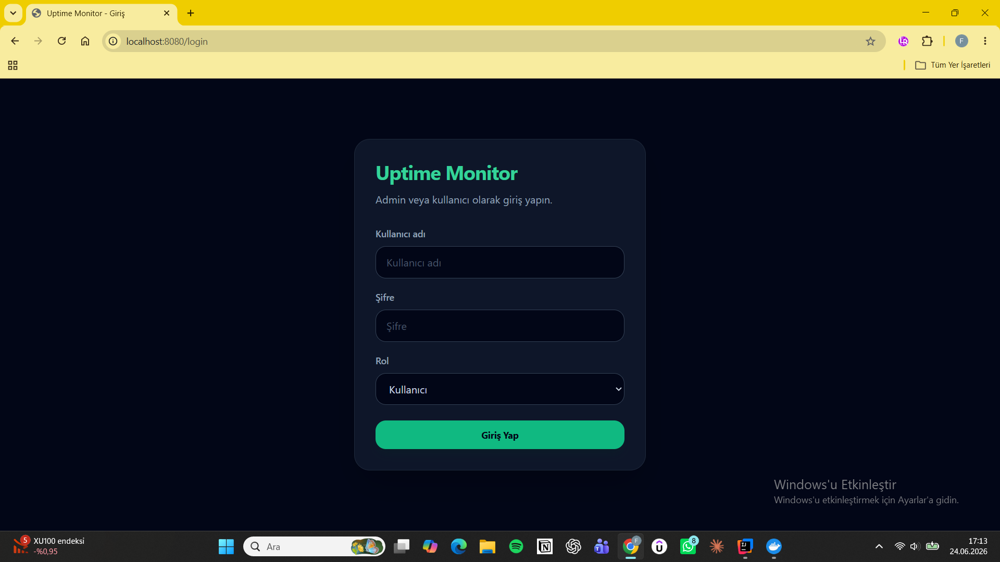
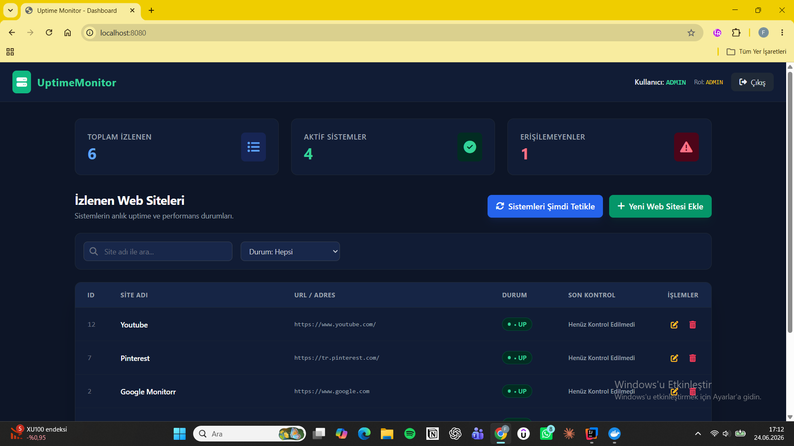

## 📸 Uygulama İçi Görseller



# 🌐 Uptime & Performance Monitor

Bu proje, belirlenen web sitelerinin veya servislerin erişilebilirlik (Uptime) durumlarını ve yanıt sürelerini real-time (anlık) olarak izlemek, analiz etmek ve raporlamak amacıyla geliştirilmiş Full-Stack bir Yönetim Bilişim Sistemleri (MIS) projesidir.

Proje, kurumsal standartlara uygun olarak Containerize (Docker) edilmiş altyapı üzerinde, rol tabanlı güvenlik (RBAC) mekanizmalarıyla desteklenerek geliştirilmiştir.

---


## 🛠️ Teknolojik Altyapı (Tech Stack)

### Backend (Arka Plan)
* **Java 17 & Spring Boot 3.x:** Güçlü, tip güvenli ve performanslı kurumsal backend mimarisi.
* **Spring Security:** Form Login tabanlı dinamik oturum yönetimi ve Rol Tabanlı Erişim Kontrolü (RBAC).
* **Spring Data JPA:** Derived Queries ve veritabanı soyutlama katmanı.
* **PostgreSQL:** Üretim ortamına uygun, yüksek performanslı ilişkisel veritabanı.

### Frontend (Ön Yüz)
* **Thymeleaf:** Backend modelleriyle veri entegrasyonu sağlayan dinamik şablon motoru.
* **Tailwind CSS (CDN):** Modern, responsive (mobil uyumlu) ve tamamen özelleştirilmiş koyu tema tasarımı.
* **FontAwesome v6.4.0:** Arayüz bileşenlerini destekleyen profesyonel vektörel ikon seti.
* **Vanilla JavaScript (Fetch API):** Sayfa yenilenmesine gerek kalmadan asenkron veri yönetimi (`/api/tasks`), dinamik arama filtreleme ve canlı dashboard sayaç güncellemeleri.

### DevOps & Altyapı
* **Docker & Docker Compose:** PostgreSQL veritabanının ve uygulamanın izole konteyner ortamında ayağa kaldırılması.
* **WSL 2:** Ubuntu tabanlı yerel konteyner ve altyapı yönetimi.

---

## 📐 Veritabanı ve Mimari Yapı

Proje, gevşek bağlılık (**Loose Coupling**) ve katmanlı mimari (**Layered Architecture**) prensiplerine sadık kalınarak tasarlanmıştır:

* **Controller Katmanı:** REST API endpoint'lerinin, yönlendirmelerin ve asenkron isteklerin yönetimi.
* **Service Katmanı:** İş mantığının (Business Logic) ve veri manipülasyonunun yürütüldüğü merkez katman.
* **Repository Katmanı:** Spring Data JPA gücüyle veritabanı sorgularının soyutlandığı katman.
* **DTO (Data Transfer Object) Katmanı:** İstek ve yanıt süreçlerinde güvenli veri taşıma kapsülleri (`TaskRequest`).
* **Arka Plan Görevleri (Background Workers):** Belirlenen periyotlarla (`@Scheduled`) arka planda çalışan ve sitelerin HTTP durum kodlarını pingleyerek veritabanını anlık güncelleyen asenkron worker mimarisi.
* **UI ve Deneyim Katmanı (Yeni):** Tarayıcının varsayılan, eski nesil `confirm()` pop-up pencereleri tamamen devre dışı bırakılmıştır. Yerine Tailwind CSS tabanlı **Özel Güvenli Çıkış** ve **Kayıt Silme** onay modalları ile asenkron işlemler için sağ üst köşede kayarak açılan **Dinamik Bildirim (Toast Notification)** sistemi entegre edilmiştir.

---

## 🔒 Güvenlik Politikası ve Kullanıcı Rolleri (RBAC)

Sistem mimarisi, yetkisiz erişimleri engellemek adına iki farklı rol tabanlı erişim kontrolü (**Role-Based Access Control**) sunar:

| Kullanıcı Adı | Şifre | Rol | Yetkiler |
| :--- | :--- | :--- | :--- |
| `user` | `1234` | **USER** | Sistem durumlarını izleme, son kayıtları listeleme, arama ve filtreleme yapma (GET). |
| `admin` | `admin123` | **ADMIN** | Yeni site ekleme (POST), güncelleme (PUT), silme (DELETE) ve tüm sistem üzerinde tam kontrol. |

> 🔑 **Güvenlik Mimarisi Notu:** Kimlik doğrulama süreçleri, tarayıcı pop-up'larını engellemek adına tamamen özelleştirilmiş **Form Login** yapısı üzerinden yürütülmektedir. Oturum yönetimi `IF_REQUIRED` politikasıyla dinamik session tabanlı kontrol edilir.

---

## 🚀 Sistemi Yerelde Çalıştırma (Get Started)

### Gereksinimler
* Docker Desktop & Docker Compose
* Java 17

### Adım Adım Kurulum

1. **Projeyi Klonlayın ve Proje Dizinine Geçin:**
```bash
   git clone <github-repo-linkiniz>
   cd Uptime_Monitor
💡 Not: Veritabanı bağlantı ayarları ve Docker ortam değişkenleri src/main/resources/application.properties ve docker-compose.yml dosyaları içerisinde birbiriyle uyumlu olarak yapılandırılmıştır. PostgreSQL varsayılan olarak 5432 portu üzerinden haberleşmektedir.
