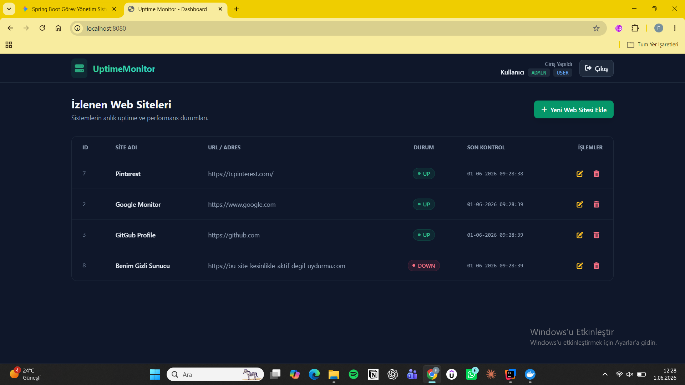

## 📸 Uygulama İçi Görseller



# 🌐 Uptime & Performance Monitor

Bu proje, belirlenen web sitelerinin veya servislerin erişilebilirlik (Uptime) durumlarını ve yanıt sürelerini real-time (anlık) olarak izlemek, analiz etmek ve raporlamak amacıyla geliştirilmiş **Full-Stack bir Yönetim Bilişim Sistemleri (MIS)** projesidir.

Proje, kurumsal standartlara uygun olarak **Containerize (Docker)** edilmiş altyapı üzerinde, rol tabanlı güvenlik (RBAC) mekanizmalarıyla desteklenerek geliştirilmiştir.

---

## 🛠️ Teknolojik Altyapı (Tech Stack)

### Backend (Arka Plan)
* **Java 17 & Spring Boot 3.x**
* **Spring Security** (HTTP Basic Auth & Form Login tabanlı Rol Yönetimi)
* **Spring Data JPA** (Derived Queries & Veritabanı Soyutlama)
* **PostgreSQL** (Üretim ortamına uygun, ilişkisel veritabanı)

### DevOps & Altyapı
* **Docker & Docker Compose** (PostgreSQL veritabanının izole ortamda ayağa kaldırılması)
* **WSL 2** (Ubuntu üzerinde container yönetimi)

---

## 📐 Veritabanı ve Mimari Yapı

Proje, gevşek bağlılık (Loose Coupling) ve katmanlı mimari (Layered Architecture) prensiplerine sadık kalınarak tasarlanmıştır:
1. **Controller Katmanı:** REST API endpoint'lerinin ve yönlendirmelerin yönetimi.
2. **Service Katmanı:** İş mantığının (Business Logic) ve veri manipülasyonunun yürütüldüğü merkez.
3. **Repository Katmanı:** Spring Data JPA gücüyle veritabanı sorgularının soyutlandığı katman.
4. **DTO (Data Transfer Object) Katmanı:** İstek ve yanıt süreçlerinde güvenli veri taşıma kapsülleri (`TaskRequest`).

---

* **Arka Plan Görevleri (Background Workers):** Belirlenen periyotlarla (Cron Jobs / `@Scheduled`) sitelerin HTTP durum kodlarını pingleyerek veritabanını anlık olarak güncelleyen asenkron worker mimarisi.

## 🔒 Güvenlik Politikası ve Kullanıcı Rolleri (RBAC)

Sistem mimarisi, yetkisiz erişimleri engellemek adına iki farklı rol tabanlı erişim kontrolü (Role-Based Access Control) sunar:

| Kullanıcı Adı | Şifre | Rol | Yetkiler |
| :--- | :--- | :--- | :--- |
| `user` | `1234` | **USER** | Sistem durumlarını izleme, son kayıtları listeleme, arama yapma (`GET`). |
| `admin` | `admin123` | **ADMIN** | Yeni site ekleme (`POST`), güncelleme (`PUT`), silme (`DELETE`) ve tam kontrol. |

* **Güvenlik Mimarisi:** REST entegrasyonları için `STATELESS` (Basic Auth) uyumluluğu barındırırken, Web UI arayüzü için dinamik session yönetimini (`IF_REQUIRED`) destekler. CSRF koruması API esnekliği için devre dışı bırakılmıştır.

---


## 🚀 Sistemi Yerelde Çalıştırma (Get Started)

### Gereksinimler
* Docker Desktop & Docker Compose
* Java 17 ve IntelliJ IDEA

### Adım Adım Kurulum

1. **Projeyi Klonlayın:**
   ```bash
   git clone <github-repo-linkiniz>
   cd Uptime_Monitor

> 💡 **Not:** Veritabanı bağlantı ayarları ve Docker ortam değişkenleri `src/main/resources/application.properties` ve `docker-compose.yml` dosyaları içerisinde birbiriyle uyumlu olarak yapılandırılmıştır. PostgreSQL varsayılan olarak `5432` portu üzerinden haberleşmektedir.